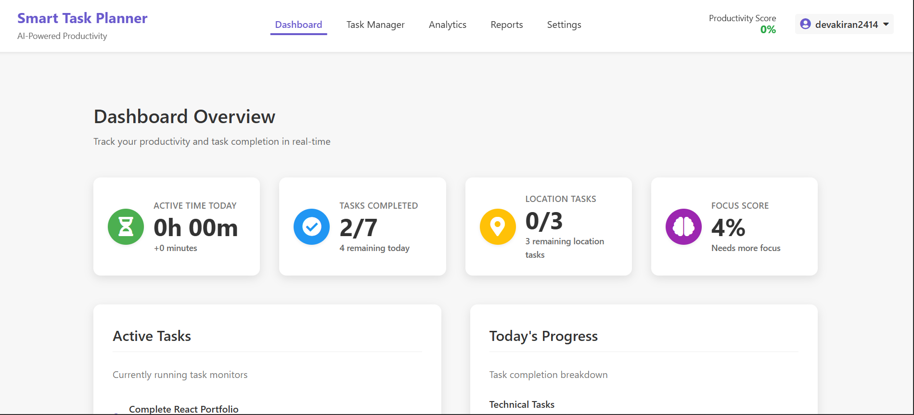
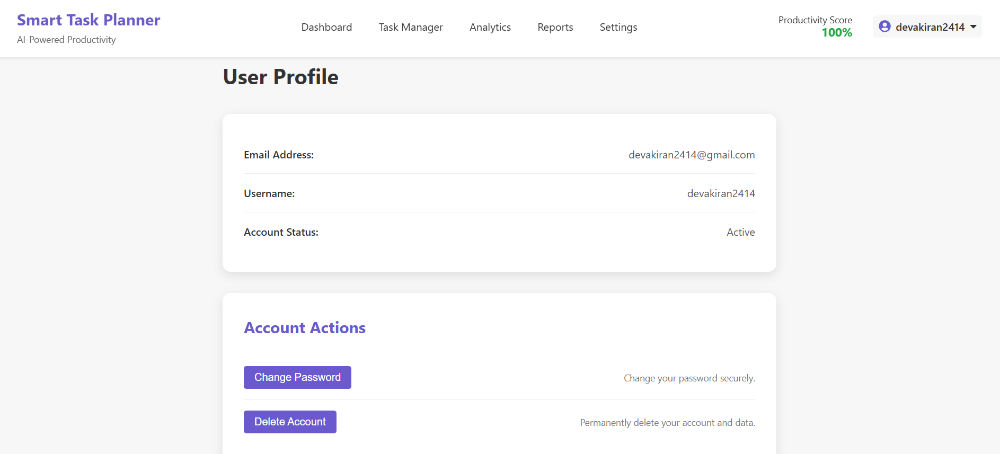
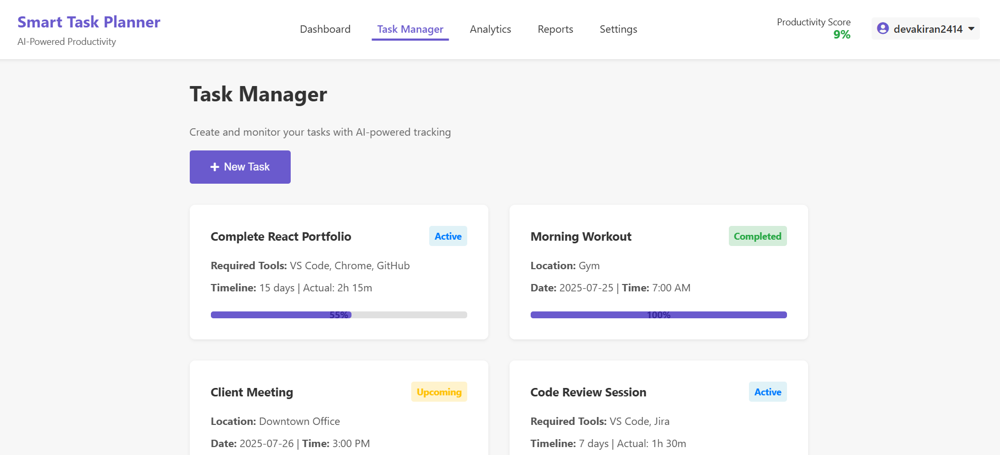
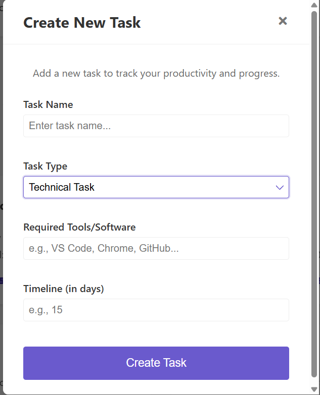
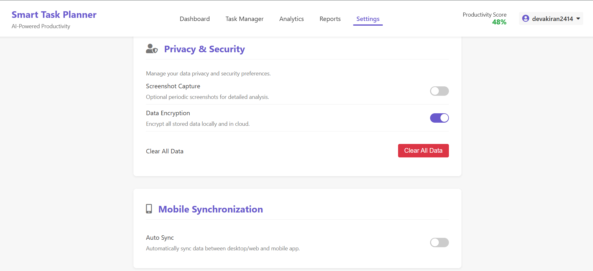

# Smart Task Planner – AI-Based Productivity Analyzer

A cross-platform smart task planner inspired by **Time Doctor 2**, designed to help you track tasks, analyze productivity, and manage time effectively.

## 🎯 Objective

This project aims to build a comprehensive productivity ecosystem that goes beyond simple task management. It not only tracks and reminds users of their tasks but also analyzes actual user behavior and task execution by monitoring:
- Tool/application usage.
- Idle vs. active time.
- Task-to-time alignment.
- Geolocation-based task completion for physical activities.
- Intelligent reports with productivity insights.

## ⚙️ Key Modules & Features

### 💻 1. Technical Task Analyzer (Web-based Simulation)

This module, while a full desktop application is planned, is currently simulated within the web app to demonstrate its core functionality.
- **Application & Window Tracking:** Logs apps and window titles to analyze focused vs. distracted time.
- **Idle Time Detection:** Detects periods of inactivity.
- **Productivity Scoring:** Provides a real-time productivity score based on simulated usage data.

### 📱 2. Physical Task Tracker (Web-based Simulation)

Simulates the features of a mobile companion app for physical tasks.
- **Geolocation Integration:** Allows you to use your current location to automatically fill in physical task locations.
- **Task Completion:** Functionally demonstrates how a task could be marked as completed based on location data.

### ☁️ 3. Cloud Sync & Report Engine (Web-based Simulation)

This section of the web app acts as the user interface for a future cloud backend, visualizing analytics and reports.
- **Dynamic Dashboards:** Displays real-time metrics, active tasks, and progress.
- **Analytics & Reports:** Automatically updates and visualizes:
  - Weekly Productivity Breakdown (Focused vs. Distracted)
  - Tool Usage Distribution (Pie Chart)
  - Focus Score Throughout the Day (Line Chart)
- **Export Options:** Includes conceptual buttons for exporting reports to PDF, CSV, and JSON.

## 🛠️ Tech Stack (Current Frontend)

- **Frontend:** React.js
- **Styling:** CSS Modules
- **Authentication:** Firebase (Authentication service)
- **Routing:** React Router DOM
- **Charts:** Recharts
- **Mapping:** React Leaflet

## 🚀 Setup Instructions

1.  **Clone the repository:**
    ```bash
    git clone [https://github.com/your-username/smart-task-planner-app.git](https://github.com/your-username/smart-task-planner-app.git)
    cd smart-task-planner-app
    ```

2.  **Install dependencies:**
    ```bash
    npm install
    ```

3.  **Set up Firebase Configuration:**
    - Create a Firebase project and enable "Email/Password" authentication.
    - Get your web app's config object.
    - Replace the placeholder values in `src/firebase.js` with your actual config.

4.  **Run the application:**
    ```bash
    npm start
    ```

## 📸 Screenshots & Demo

### Dashboard

### Profile Page

### Task Page

### Creating Technical Task

### Physical Task


### Settings Page



## 📄 License

This project is licensed under the MIT License.